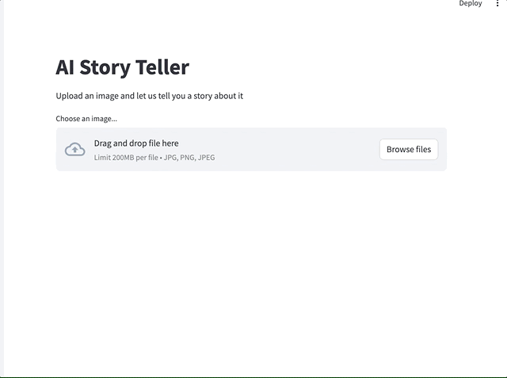
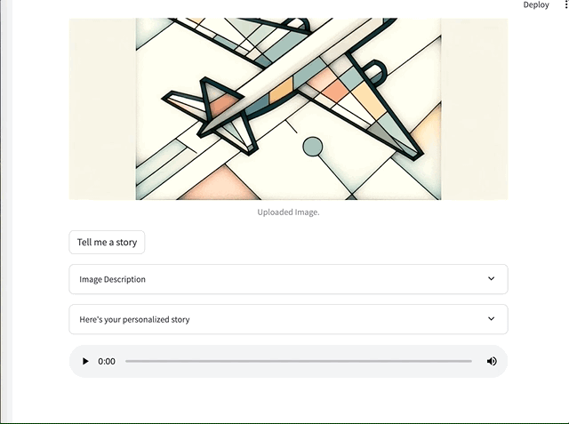

# AI Story Teller

AI Story Teller is a project that utilizes Hugging Face, Langchain and AI models to create a story telling application. The goal of this project is to incrementally add features to build an application that can read images, generate text, and produce audio for a story.

## Installation

To install the dependencies for AI Story Teller, follow these steps:

1. Make sure you have Python installed on your system. You can download Python from the official website: https://www.python.org/downloads/

2. Clone the repository to your local machine:

    ```shell
    git clone https://github.com/wolivera/ai-story-teller.git
    ```

3. Navigate to the project directory:

    ```shell
    cd ai-story-teller
    ```

4. Install the required Python packages using pip:

    ```shell
    pip install -r requirements.txt
    ```

5. Create a `.env` file from the `.env.example` and set the values

## Demo





## Usage

The app uses Streamlit to create a web-based interface for the AI Story Teller. To run the application run:

```shell
streamlite run app.py
```

## Contributing

Contributions are welcome! If you'd like to contribute to AI Story Teller, please follow these guidelines:

1. Fork the repository and create a new branch.

2. Make your changes and test them thoroughly.

3. Submit a pull request describing your changes.

## License

This project is licensed under the [MIT License](LICENSE).
